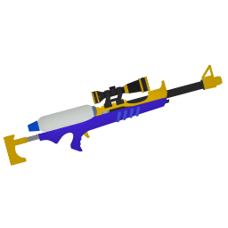
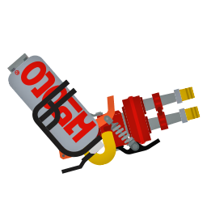
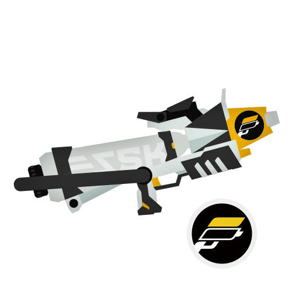
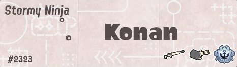

 

<code style="color : White"> Become [emotional and it's goodbye](https://music.youtube.com/watch?v=QprnVxCveSY&si=I5gtf0Mi243QDTXV), go faster and farther than anyone else, come on.  </code>

***
<code style="color : White"> [♡](https://rentry.co/lord-pain) Mar.9.2026 🥹🥹🥹🫶 </code>

[rentry](https://rentry.co/lady-angel) , [atabook](https://melonoctoling.atabook.org) , [strawpage](https://melonoctoling.straw.page/amegakure) 

 17 , en / fr , gnc & queer , taken   
 mentally ill & phys issues , plural  
︲ usually unfriendly to strangers & dry to acquaintances ︲  

***
 ( ^: :^ )  
 

***
Often open to play splatoon 3 (or 2) 
Splatoon 3 stats (outdated usually):  
LVL: 129 - Rank: A+ (highest S) - Turf inked: 5,987,378p - Total wins: 4,089 - Badges: 127 / 1,542 - Shifts worked: 1045  
Most played weapons:  
   

Splashtag: 
  
Splatlings progress: 
1★ 15/15  
2★ 12/15   
3★ 7/15   
4★ 6/15   
5★ 0/15   

***

 <code style="color : White"> I'm not going back, I don't have anything else anyway. </code>

